<p align="center"></p>
<h1 align="center">PrintPi</h1>
<p align="center">
  <a href="https://github.com/Snakzi/PrintPi/actions/workflows/tests.yml"></a>
  <a href="https://github.com/Snakzi/PrintPi/actions/workflows/docker.yml"></a>
  <a href="https://github.com/Snakzi/PrintPi/releases"></a>
  <a href="https://github.com/Snakzi/PrintPi/pkgs/container/printpi"></a>
  
</p>

My print server for the Raspberry Pi. A Python daemon talks Marlin over USB, Laravel and Vue sit on
top. Built for my Prusa MK4S, works with any printer that speaks Marlin over a USB cable.

<p align="center">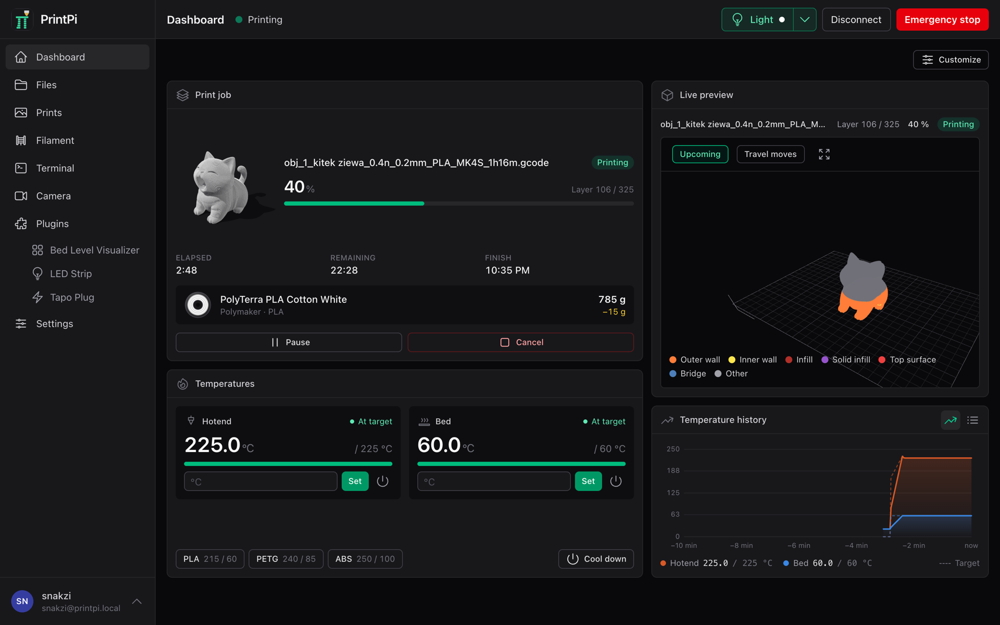</p>

- Print, pause, cancel, print again, with a live 3D view of the running print
- Upload from PrusaSlicer, OrcaSlicer, SuperSlicer or Cura
- Camera, layer timelapse and a postcard for every print
- Filament manager with spools and a colour card; load, unload and change filament as a walkthrough on the panel or the phone
- Plugins: LED strip, bed level visualizer, Tapo/Kasa plugs, webhook, [your own](docs/plugins.md)
- Updates from the settings page, printer firmware updates too
- A touch panel for a 7" screen at the printer

The filament walkthrough drives the extruder itself with plain G-code, so it works on any Marlin
printer and asks its questions on the panel or the phone, not on the printer's display. On a Prusa,
switch the filament sensor's autoload off first, or the printer starts a load of its own the moment
it sees the filament.

## Screenshots

| | |
|:--:|:--:|
| 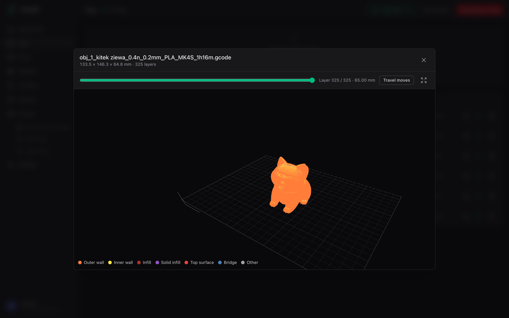 | 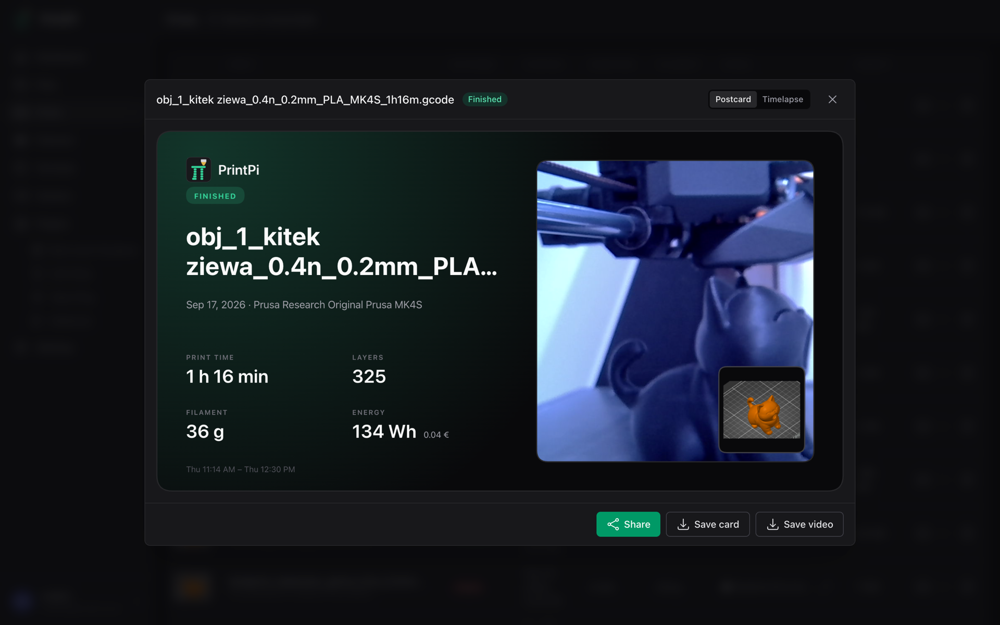 |
| G-code preview | Postcard after a print |
| 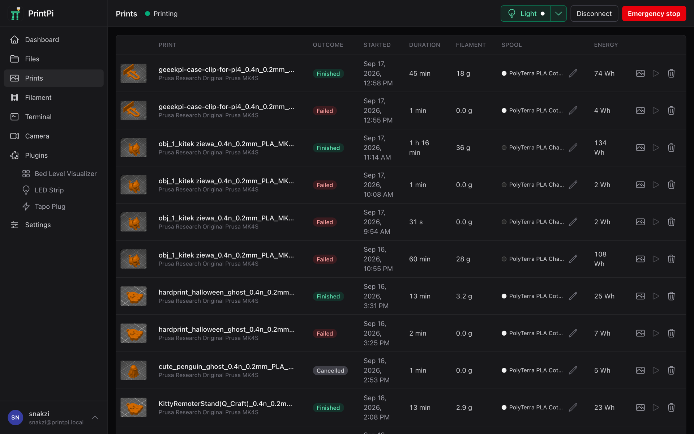 | 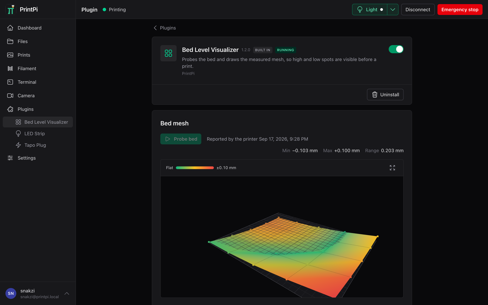 |
| Print history | Bed level visualizer |
| 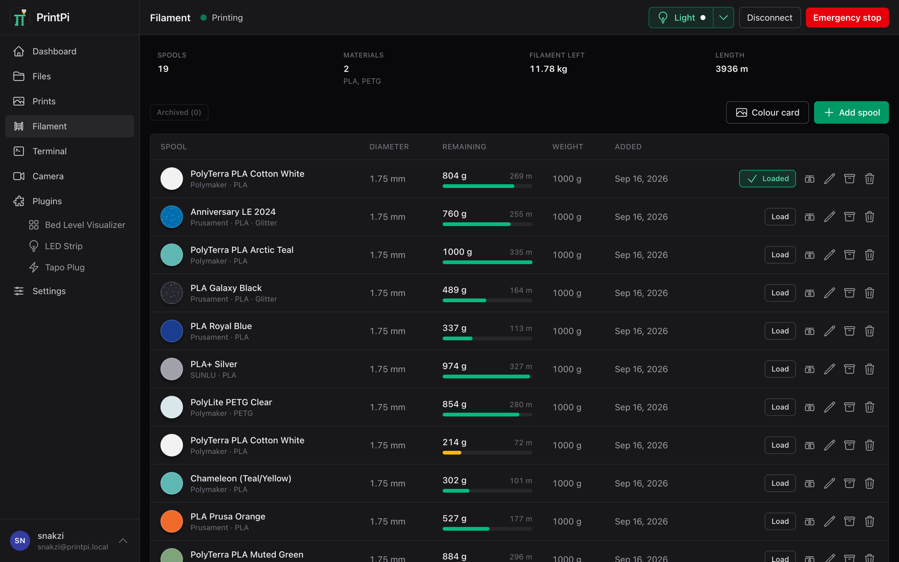 | 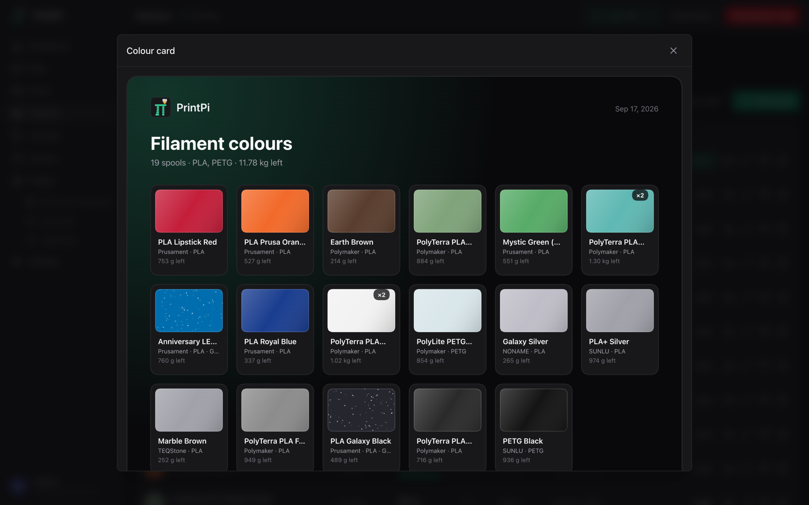 |
| Filament manager | Colour card |

## The screen at the printer

`/panel`, made for a 7" touch display. The installer sets up the kiosk.

| | |
|:--:|:--:|
| 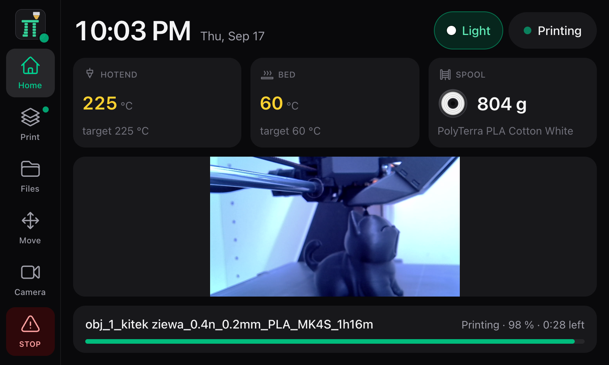 | 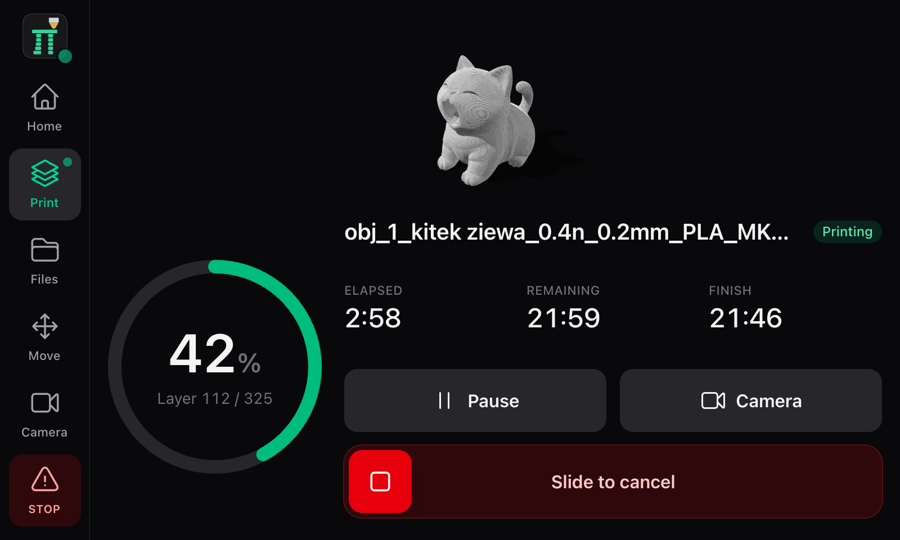 |
| 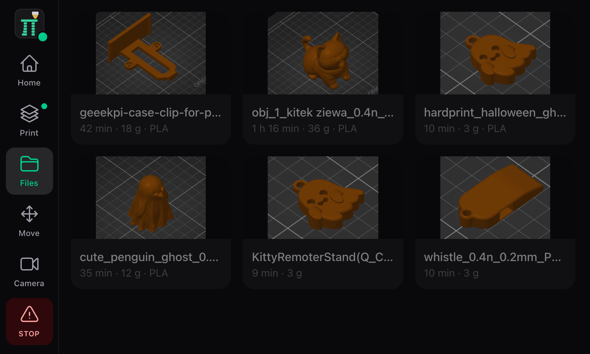 | 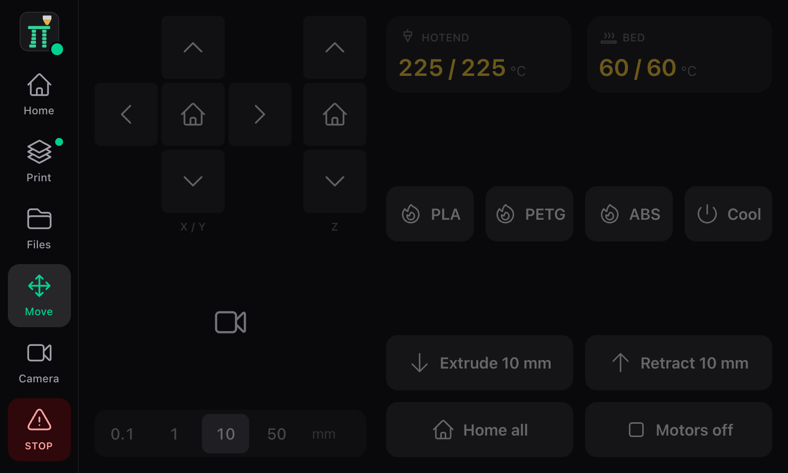 |

## Which Pi

A **Raspberry Pi 4** with a fan, at least when a display is attached. A Pi 3 works too, but
mine was overwhelmed once the display came on.

## Installing

The easiest way is the ready-made image. Open the Raspberry Pi Imager, go to its settings and add
this repository:

```
https://github.com/Snakzi/PrintPi/releases/latest/download/imager.json
```

PrintPi now sits in the OS list like any other system. Pick it, set user, Wi-Fi and SSH in the
Imager as usual, flash the card, plug the printer in, boot. After a minute open
http://printpi.local (or the hostname you chose) and the setup wizard takes over. Under the hood
it is Raspberry Pi OS Lite 64-bit with PrintPi on top, nothing else. If the page does not come
up, `printpi-firstboot.log` on the card's boot partition says what the first boot did.

Already have a Pi running Raspberry Pi OS Lite 64-bit? Then install it there:

```bash
curl -fsSL https://raw.githubusercontent.com/Snakzi/PrintPi/main/deploy/get-printpi.sh | sudo bash
```

From then on updates come from the settings page. `PRINTPI_PANEL=1 sudo -E bash` instead of
`sudo bash` also sets up the kiosk for the touch screen; on the image, run the one-liner once
with that flag.

## Docker

```bash
docker run -d --name printpi --restart unless-stopped \
  -p 8050:80 -v printpi-data:/var/lib/printpi \
  --device /dev/ttyACM0:/dev/printer \
  ghcr.io/snakzi/printpi:latest
```

PrintPi is then at http://localhost:8050. Cameras, plugs, LED strips, Mac and Windows:
[docs/docker.md](docs/docker.md).

## Slicer

Add a physical printer in the slicer with the host type, address and API key from Settings > Slicer.
Text G-code only, so switch binary G-code off for printers that default to `.bgcode`.

## Development

[docs/development.md](docs/development.md) for the layout, the daemon and the web app on a Mac,
[docs/plugins.md](docs/plugins.md) for writing a plugin.
